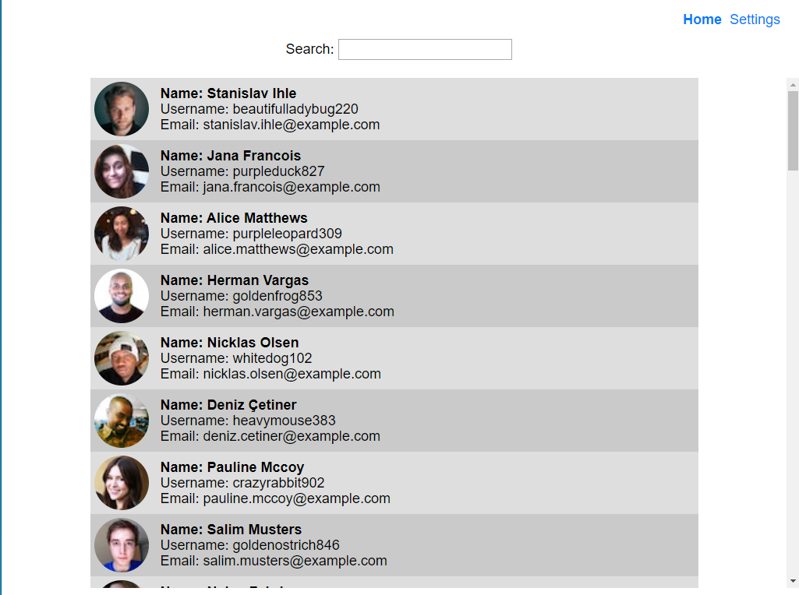
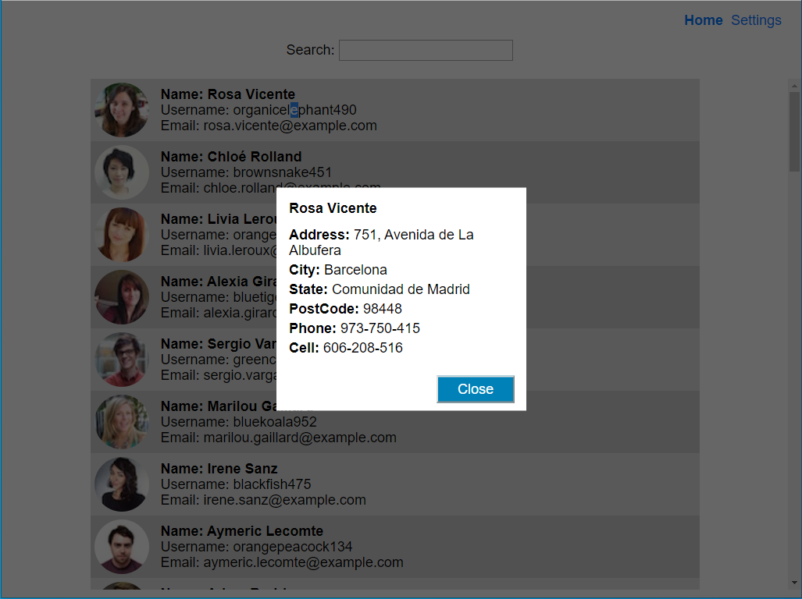
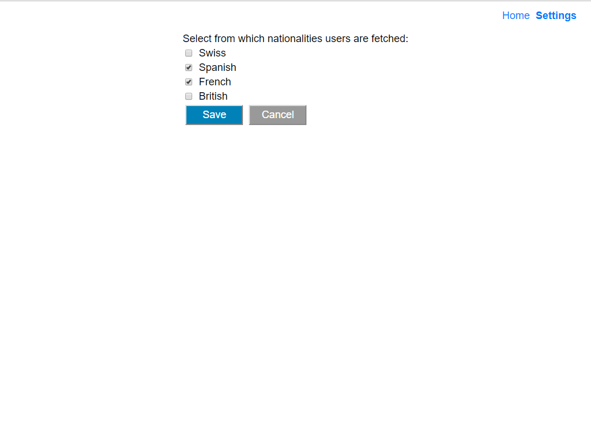

# Address book app

## Demo

This a link to a demo of this app: [Address Book App](https://panglat.github.io/code-challenge-address-book-app/).

## Home page
This is a fictional address book app, where the visitor can search for users' addresses and personal information. The app displays a list of users for clients to browse and get personal information for a selected user.

The user&#39;s list will automatically load more users as the visitor scroll down. An animated **loading...** message will be displayed at the bottom of the list while the visitor waits.
To improve the user&#39;s experience, the app will always pre-emptively fetch the next batch of users in advance, making use of idle time. But they will not be displayed until the visitor has scrolled to the bottom of the user&#39;s list.
When the visitor reaches the end of the list and there are no more users to display, an **end of users catalog** message will be displayed at the bottom of the list.
There is a user search field on the top of the app. It is case insensitive and filters the results by first name + last name.

## Details modal

When the visitor clicks on a specific user in the row, a detail modal with additional info will be opened.

## Settings page

At the top-right of the app, the visitors can navigate to the settings page by clicking **Settings** in the navigation bar.
Here the visitor can set from which nationalities the users are fetched for browsing/searching. Possible choices are: Swiss, Spanish, French and British.

## Available Scripts

In the project directory, you can run:

### `npm start`

Runs the app in the development mode. 
Open [http://localhost:3000](http://localhost:3000) to view it in the browser.

### `npm test`

Launches the test runner in the interactive watch mode. 

### `npm build`

Builds the app for production to the `build` folder. 
It correctly bundles React in production mode and optimizes the build for the best performance.

The build is minified and the filenames include the hashes. 
Your app is ready to be deployed!
